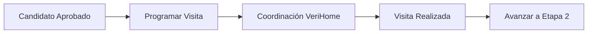
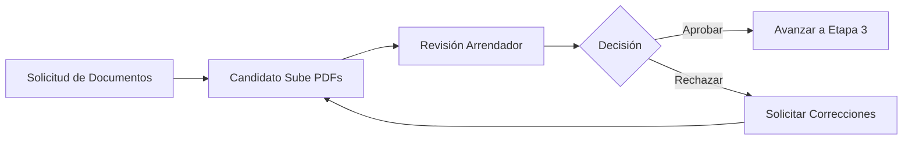
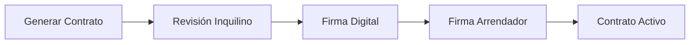

# 📋 Flujo de Contratos y Workflow de VeriHome

## 🎯 Visión General

VeriHome implementa un sistema de workflow de 3 etapas para gestionar el proceso de arrendamiento desde el interés inicial hasta la firma del contrato. Este documento explica el flujo completo y la arquitectura de sincronización entre arrendadores y arrendatarios.

## 🏗️ Arquitectura del Sistema

### Componentes Principales

```
┌─────────────────────────────────────────────────────────────┐
│                     FRONTEND (React)                         │
├──────────────────────┬───────────────────────────────────────┤
│   Panel Arrendador   │      Panel Arrendatario/Candidato    │
│                      │                                       │
│  MatchedCandidates   │       TenantWorkflowTracker          │
│  VisitScheduleModal  │       TenantDocumentUpload           │
│  WorkflowActions     │       ContractReview                 │
└──────────┬───────────┴────────────────┬─────────────────────┘
           │                             │
           ▼                             ▼
┌──────────────────────────────────────────────────────────────┐
│                    BACKEND (Django)                          │
├──────────────────────────────────────────────────────────────┤
│                                                              │
│  WorkflowActionAPIView    TenantProcessesAPIView            │
│        ▲                           ▲                        │
│        │                           │                        │
│        └───────────┬───────────────┘                        │
│                    ▼                                        │
│         PropertyInterestRequest Model                       │
│         - workflow_stage (1, 2, 3)                         │
│         - workflow_status                                  │
│         - workflow_data (JSON)                             │
│                                                             │
└──────────────────────────────────────────────────────────────┘
```

## 📊 Flujo de Trabajo de 3 Etapas

### **Etapa 1: Visita** 🏠
**Estado:** `visit_scheduled` → `visit_completed`



**Acciones del Arrendador:**
- Programar visita con fecha/hora
- Marcar visita como completada
- Avanzar candidato a documentos

**Vista del Arrendatario:**
- Ver detalles de visita programada
- Recibir notificaciones
- Estado actualizado en tiempo real

### **Etapa 2: Documentos** 📄
**Estado:** `documents_pending` → `documents_review` → `documents_approved`



**Documentos Requeridos:**

#### TOMADOR (Inquilino)
- Cédula de Ciudadanía (frente y atrás)
- Pasaporte
- Cédula de Extranjería
- Certificados laborales
- Cartas de recomendación

#### CODEUDOR
- Cédula de Ciudadanía (frente y atrás)
- Pasaporte
- Certificados laborales (codeudor laboral)
- Certificado de Libertad y Tradición (codeudor finca raíz)

#### OTROS
- Documentos adicionales con descripción personalizada

### **Etapa 3: Contrato** 📝
**Estado:** `contract_ready` → `contract_signed` → `completed`



## 🔄 Sistema de Sincronización

### Problema Original
Los paneles de arrendador y arrendatario no estaban sincronizados. Las acciones del arrendador no se reflejaban en el panel del inquilino.

### Solución Implementada

#### 1. **Modelo de Datos Persistente**
```python
class PropertyInterestRequest(BaseRequest):
    # Campos de workflow para sincronización
    workflow_stage = models.IntegerField(choices=WORKFLOW_STAGES, default=1)
    workflow_status = models.CharField(max_length=30, choices=WORKFLOW_STATUSES)
    workflow_data = models.JSONField(default=dict)
    workflow_updated_at = models.DateTimeField(auto_now=True)
```

#### 2. **API de Acciones del Workflow**
```python
# WorkflowActionAPIView - Persiste cambios en BD
def post(self, request):
    action = request.data.get('action')
    
    if action == 'visit_completed':
        match_request.workflow_stage = 2
        match_request.workflow_status = 'documents_pending'
        match_request.save()  # CRÍTICO: Persistir en BD
```

#### 3. **Vista del Inquilino Sincronizada**
```python
# TenantProcessesAPIView - Lee estado real de BD
def _format_property_request(self, request_obj):
    # LEER ESTADO REAL DEL WORKFLOW DESDE LA BASE DE DATOS
    current_stage = request_obj.workflow_stage
    status_key = request_obj.workflow_status
    workflow_data = request_obj.workflow_data
```

## 🛠️ Componentes del Sistema

### Frontend Components

#### Para Arrendadores
- `MatchedCandidatesView.tsx` - Lista de candidatos y acciones
- `VisitScheduleModal.tsx` - Modal para programar visitas
- `LandlordContractsDashboard.tsx` - Panel principal de contratos

#### Para Arrendatarios
- `TenantWorkflowTracker.tsx` - Seguimiento del proceso (504 líneas)
- `TenantDocumentUpload.tsx` - Sistema de carga de documentos (590 líneas)
- `TenantContractsDashboard.tsx` - Panel de contratos del inquilino

### Backend APIs

#### Endpoints Principales
```
POST /api/v1/contracts/workflow-action/
  - Ejecuta acciones del workflow (visit_schedule, visit_completed, etc.)
  
GET /api/v1/contracts/tenant-processes/
  - Lista procesos de arrendamiento del inquilino
  
GET /api/v1/requests/api/documents/process/{id}/checklist/
  - Obtiene checklist de documentos
  
POST /api/v1/requests/api/documents/upload/
  - Sube documentos PDF
```

## 📁 Estructura de Archivos

```
/mnt/c/Users/wilso/Desktop/NUEVOS PROYECTOS/
├── contracts/
│   ├── api_views.py          # WorkflowActionAPIView, TenantProcessesAPIView
│   ├── models.py              # Modelos de contratos
│   └── serializers.py         # Serializadores
│
├── requests/
│   ├── models.py              # PropertyInterestRequest con campos workflow
│   ├── document_api_views.py # APIs de documentos
│   └── migrations/
│       └── 0003_propertyinterestrequest_workflow_data_and_more.py
│
├── frontend/src/components/contracts/
│   ├── TenantWorkflowTracker.tsx    # Componente principal de seguimiento
│   ├── TenantDocumentUpload.tsx     # Sistema de carga de documentos
│   └── MatchedCandidatesView.tsx    # Vista de candidatos para arrendador
│
└── tests/
    ├── test_workflow_synchronization.py  # Test de sincronización
    └── test_document_system_e2e.py       # Test del sistema de documentos
```

## 🚀 Flujo de Implementación

### 1. Candidato Envía Solicitud
```javascript
// PropertyInterestForm.tsx
const handleSubmit = async (data) => {
  await requestService.createPropertyInterest({
    property: propertyId,
    monthly_income: data.income,
    employment_type: data.employment,
    // ...
  });
};
```

### 2. Arrendador Aprueba y Programa Visita
```javascript
// MatchedCandidatesView.tsx
const handleScheduleVisit = async (candidateId, visitData) => {
  await contractService.executeWorkflowAction({
    match_request_id: candidateId,
    action: 'visit_schedule',
    visit_data: visitData
  });
};
```

### 3. Inquilino Ve Estado Actualizado
```javascript
// TenantWorkflowTracker.tsx
useEffect(() => {
  fetchTenantProcesses();  // Obtiene estado actual desde BD
}, []);

// La vista se actualiza automáticamente con el estado real
```

### 4. Carga de Documentos
```javascript
// TenantDocumentUpload.tsx
const handleUploadDocument = async () => {
  const formData = new FormData();
  formData.append('property_request', processId);
  formData.append('document_type', selectedDocumentType);
  formData.append('document_file', uploadFile);
  
  await fetch('/api/v1/requests/api/documents/upload/', {
    method: 'POST',
    body: formData
  });
};
```

## 🔍 Debugging y Monitoreo

### Logs del Sistema
```python
# En WorkflowActionAPIView
print(f"🚀 VISIT COMPLETED - PropertyInterestRequest {match_request.id} updated - Stage: {match_request.workflow_stage}")

# En TenantProcessesAPIView
print(f"🔍 TENANT VIEW - PropertyRequest {request_obj.id}: Stage={current_stage}, Status={status_key}")
```

### Verificación de Estado
```sql
-- Consulta SQL para verificar estado del workflow
SELECT 
    id,
    workflow_stage,
    workflow_status,
    workflow_data,
    workflow_updated_at
FROM requests_propertyinterestrequest
WHERE requester_id = 'USER_ID';
```

## 📊 Estados y Transiciones

| Etapa | Estado | Descripción | Siguiente Acción |
|-------|--------|-------------|------------------|
| 1 | `visit_scheduled` | Visita programada | Confirmar visita realizada |
| 1 | `visit_completed` | Visita completada | Solicitar documentos |
| 2 | `documents_pending` | Esperando documentos | Inquilino sube PDFs |
| 2 | `documents_review` | Documentos en revisión | Arrendador revisa |
| 2 | `documents_approved` | Documentos aprobados | Generar contrato |
| 3 | `contract_ready` | Contrato listo | Inquilino firma |
| 3 | `contract_signed` | Contrato firmado | Activar arrendamiento |
| 3 | `completed` | Proceso completado | - |

## 🎯 Casos de Uso

### Caso 1: Flujo Completo Exitoso
1. Inquilino envía solicitud de interés
2. Arrendador aprueba candidato
3. Arrendador programa visita
4. Visita se realiza exitosamente
5. Arrendador solicita documentos
6. Inquilino sube todos los documentos
7. Arrendador aprueba documentos
8. Sistema genera contrato
9. Ambas partes firman
10. Arrendamiento activo

### Caso 2: Rechazo de Documentos
1. Inquilino sube documentos
2. Arrendador encuentra problemas
3. Arrendador rechaza con comentarios
4. Inquilino recibe notificación
5. Inquilino corrige y re-sube
6. Arrendador aprueba
7. Continúa a contrato

## 🔐 Seguridad y Validaciones

### Validaciones de Documentos
- Solo archivos PDF permitidos
- Tamaño máximo: 10MB
- Tipos de documento predefinidos
- Validación de campos requeridos

### Permisos de Usuario
- Arrendadores: Solo pueden ver/editar sus propios procesos
- Inquilinos: Solo pueden ver sus solicitudes aceptadas
- Documentos: Acceso restringido por usuario

## 📈 Métricas y Analytics

### KPIs del Workflow
- Tiempo promedio por etapa
- Tasa de conversión por etapa
- Documentos más rechazados
- Tiempo total del proceso

### Queries de Análisis
```python
# Procesos en cada etapa
from requests.models import PropertyInterestRequest

stage_1 = PropertyInterestRequest.objects.filter(workflow_stage=1).count()
stage_2 = PropertyInterestRequest.objects.filter(workflow_stage=2).count()
stage_3 = PropertyInterestRequest.objects.filter(workflow_stage=3).count()

# Tiempo promedio en etapa 2
from django.db.models import Avg
avg_time = PropertyInterestRequest.objects.filter(
    workflow_stage__gte=2
).aggregate(
    avg_time=Avg('workflow_updated_at' - 'created_at')
)
```

## 🚦 Testing

### Test de Sincronización
```bash
python test_workflow_synchronization.py
```

Verifica:
- ✅ Persistencia de cambios en BD
- ✅ Sincronización entre paneles
- ✅ Transiciones de estado correctas
- ✅ Datos del workflow actualizados

### Test de Documentos
```bash
python test_document_system_e2e.py
```

Verifica:
- ✅ Modelo TenantDocument creado
- ✅ API de checklist funcional
- ✅ Carga de documentos
- ✅ Sistema de revisión

## 📝 Conclusiones

El sistema de workflow de VeriHome proporciona:

1. **Transparencia Total**: Ambas partes ven el mismo estado
2. **Sincronización Perfecta**: Cambios reflejados inmediatamente
3. **Trazabilidad Completa**: Todo queda registrado en BD
4. **Experiencia Fluida**: Proceso paso a paso claro
5. **Escalabilidad**: Arquitectura lista para crecer

## 🔮 Mejoras Futuras

- [ ] Notificaciones push en tiempo real
- [ ] Firma biométrica de contratos
- [ ] Integración con servicios de verificación
- [ ] Dashboard analytics avanzado
- [ ] Automatización con IA para revisión de documentos
- [ ] Sistema de plantillas de contrato
- [ ] Integración con pasarelas de pago

---

**Última actualización:** Enero 2025  
**Versión:** 1.0.0  
**Autor:** Equipo VeriHome Development